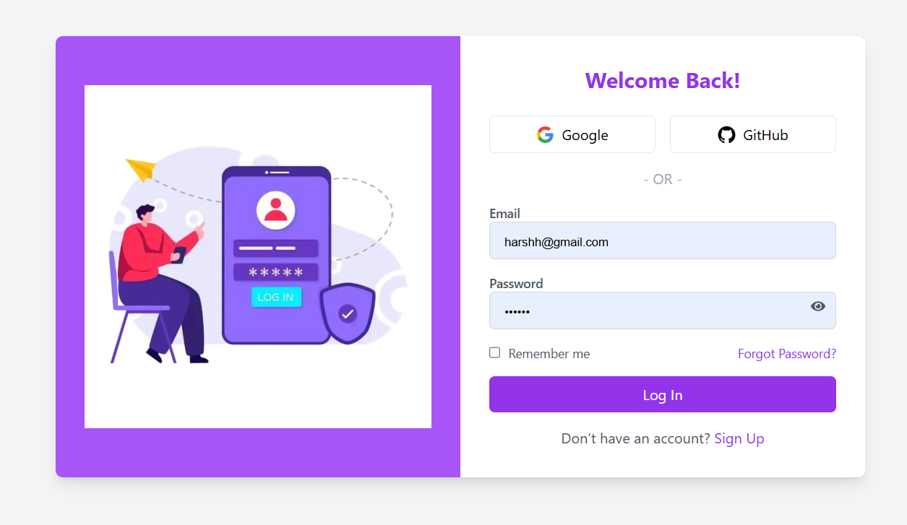
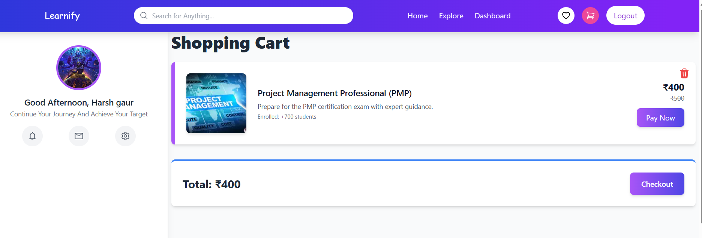
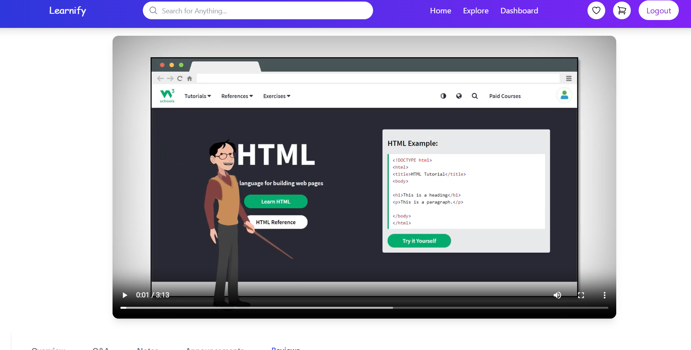

# Learnify
A Course-selling platform where users could purchase courses and admins could manage course  content via an admin panel. Implemented a seamless user experience and optimized UI design using Tailwind CSS. 

## 🚀 Features

- 🔐 User Authentication with OTP verification
- 🛒 Efficient Cart System & Quick Book Feature
- 📦 Admin Dashboard for courses  Management
- 💳 Razorpay Payment Gateway Integration
- 🧾 Dynamic Checkout Page with User & Product Summary
- 📚 Course Management with Lecture Playback & Reviews
- 📽️ Video Lectures per Module
- 📝 Reviews & Notes System
- 📦 Dashboard with a Profile Section of User
- 📦 Search Functionality for courses 

## 📸 Screenshots

### Homepage

###  Dashboard

### Login

### About Course

### Explore Page

### Cart Page

### WishList Page

### Lecture Screen
